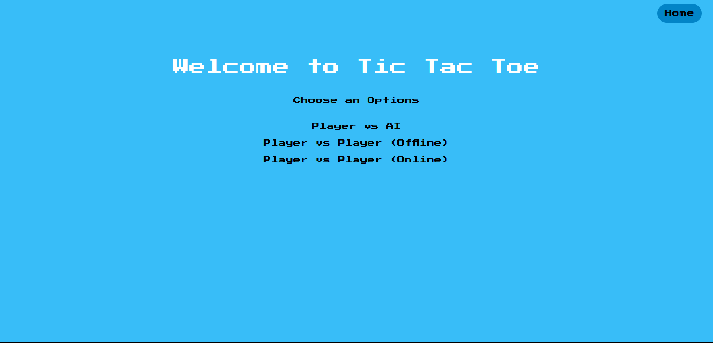
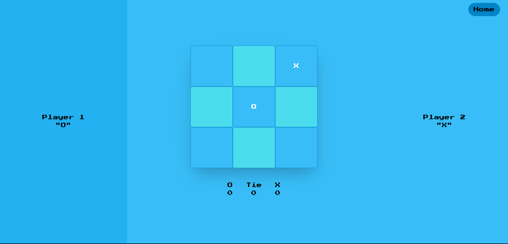
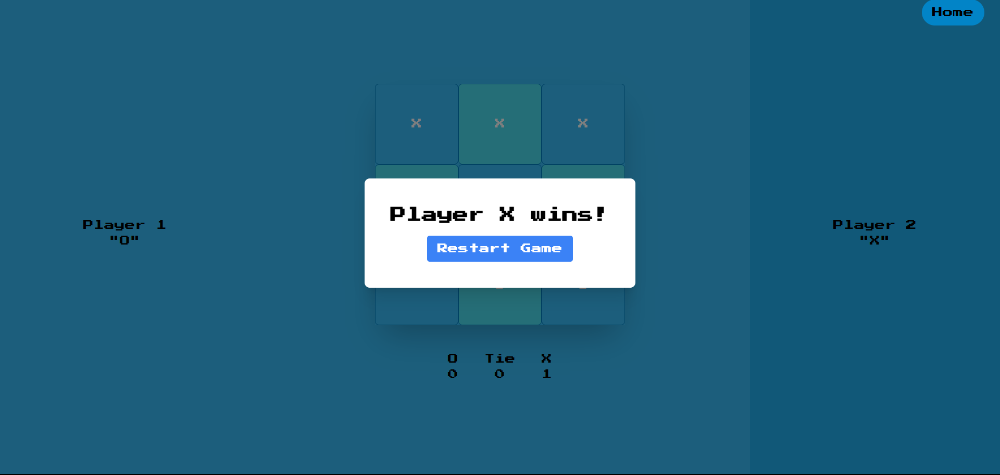

# Tic Tac Toe Game

A modern, full-stack Tic Tac Toe game built with React, TypeScript, Node.js, and WebSockets. Features multiple game modes including Player vs AI, offline multiplayer, and real-time online multiplayer.

## 🎮 Features

- **Multiple Game Modes:**

  - Player vs AI (Smart AI opponent)
  - Player vs Player (Offline - same device)
  - Player vs Player (Online - real-time multiplayer)

- **Real-time Multiplayer:**
  - WebSocket-based communication
  - Room-based matchmaking
  - Live game state synchronization

## 🛠️ Tech Stack

### Frontend

- **React** with TypeScript
- **React Router** for navigation
- **Tailwind CSS** for styling
- **WebSocket** for real-time communication

### Backend

- **Node.js** with TypeScript
- **Express.js** for HTTP server
- **WebSocket Server** for real-time communication
- **UUID** for unique room generation

## 📸 Screenshots

### Home Screen

_Add your home screen screenshot here_


### Game in Progress

_Add your game playing screenshot here_


### Winning Screen

_Add your winning screen screenshot here_


## 🚀 Getting Started

### Prerequisites

- Node.js (v14 or higher)
- npm or yarn or bun

### Installation

1. **Clone the repository**

   ```bash
   git clone  https://github.com/Ritikchauhan1704/Multiplayer-AI-tic-tac-toe.git
   cd Multiplayer-AI-tic-tac-toe
   ```

2. **Install backend dependencies**

   ```bash
   cd backend
   npm install
   ```

3. **Install frontend dependencies**

   ```bash
   cd frontend
   npm install
   ```

4. **Set up environment variables**
   Create a `.env` file in the backend directory:
   ```env
   PORT=3000
   ```

### Running the Application

1. **Start the backend server**

   ```bash
   cd backend
   npm run dev
   ```

2. **Start the frontend development server**

   ```bash
   cd frontend
   npm start
   ```

3. **Open your browser**
   Navigate to `http://localhost:3000` (or the port shown in your terminal)

## 🎯 How to Play

### Player vs AI

1. Select "Player vs AI" from the home screen
2. You play as "O" and the AI plays as "X"
3. Click on any empty cell to make your move
4. The AI will automatically make its move after you

### Offline Multiplayer

1. Select "Player vs Player (Offline)"
2. Players take turns on the same device
3. Player 1 is "O" and Player 2 is "X"

### Online Multiplayer

1. Select "Player vs Player (Online)"
2. Share the room URL with another player
3. Wait for the second player to join
4. Play in real-time against your opponent

## 🔧 API Reference

### WebSocket Events

#### Client to Server

- `online` - Join/create online game room
- `ai` - Play against AI
- `DATA` - Send game move
- `restart` - Restart the game

#### Server to Client

- `waiting` - Waiting for another player
- `start` - Game started
- `DATA` - Game state update
- `error` - Error message

## 🐛 Known Issues

- Players might need to refresh if the WebSocket connection is lost
- Room cleanup happens when all players disconnect
 
**Enjoy playing Tic Tac Toe! 🎯**
